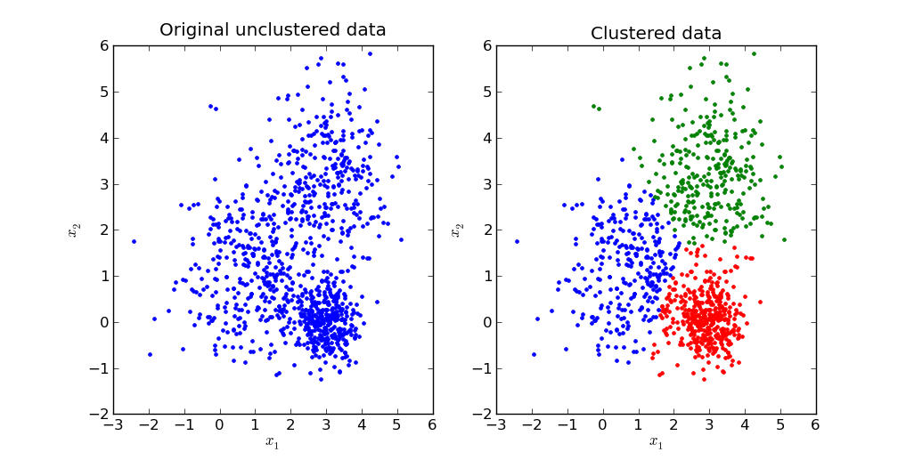

# K-Means-Clustering
This python implementation of K-means clustering uses either of Minkowski distance, Spearman Correlation or (unknown) while determining the cluster for each data object.

### Description
K-means clustering is one of the simplest and popular unsupervised machine learning algorithms. A cluster refers to a collection of data points aggregated together because of certain similarities.
We’ll define a target number k, which refers to the number of centroids we need in the dataset. A centroid is the imaginary or real location representing the center of the cluster.
Every data point is allocated to each of the clusters through reducing the in-cluster sum of squares.

In other words, the K-means algorithm identifies k number of centroids, and then allocates every data point to the nearest cluster, while keeping the centroids as small as possible.
The ‘means’ in the K-means refers to averaging of the data; that is, finding the centroid.

In the output, all the data points along with the cluster to which it belongs is displayed.